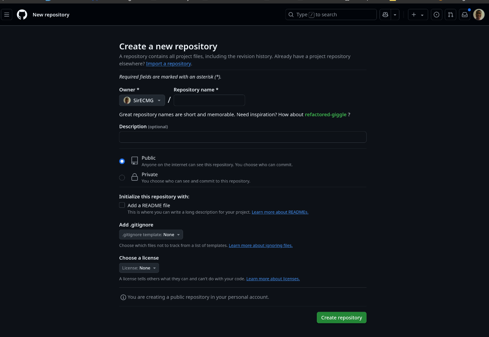

# create new repo from frontend 

Login into your github account then head to

[New Repository](https://github.com/new)




# push repo using ssh
```
git remote add origin git@github.com:SirECMG/elton-blog.git
git branch -M main
git push -u origin main
```